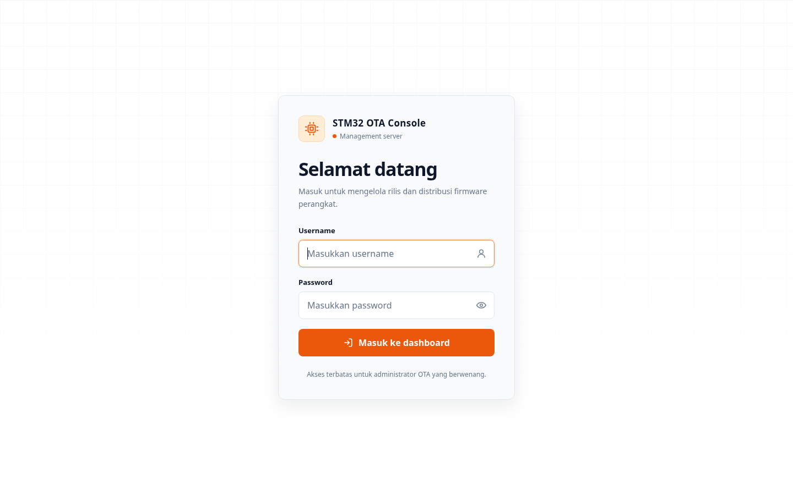
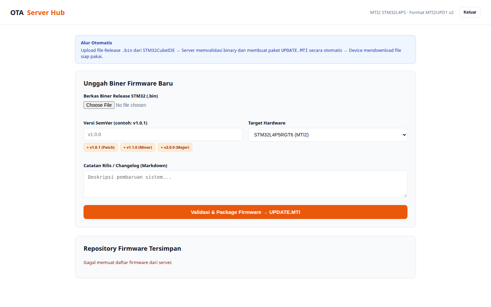

# Demo Dashboard OTA Server

Firmware management backend for IoT microcontrollers. Handles binary uploads, SHA-256 integrity verification, device polling, and versioned update delivery — with Cloudflare Tunnels for public HTTPS access without port forwarding.

---

## Web Interface

### Admin Login



### Dashboard



---

## Features

- **Firmware Upload** — binary `.bin` file upload with extension validation and secure storage via `multer`
- **SHA-256 Checksum** — automatic cryptographic hash generation for firmware integrity validation on the device side
- **PostgreSQL Storage** — firmware metadata (version, hardware target, checksum, file size, release notes) and device tracking
- **OTA Polling & Download** — dedicated endpoints for IoT devices to check for updates and download binaries
- **Cloudflare Tunnels** — expose the local server to the public internet securely, no router port forwarding required

---

## Prerequisites

- Node.js
- Docker & Docker Compose
- Cloudflared CLI

---

## Project Structure

```
dstx-demo-dashboard-ota-server/
├── src/
│   ├── controllers/
│   │   ├── admin_controller.js
│   │   └── ota_controller.js
│   ├── database/
│   │   ├── db.js
│   │   └── init.js
│   ├── middlewares/
│   │   └── upload.js
│   ├── routes/
│   │   ├── admin_routes.js
│   │   └── ota_routes.js
│   └── utils/
│       └── hash_helper.js
├── storage/
│   └── firmwares/       # Physical .bin file storage
├── .env
├── docker-compose.yml
├── package.json
├── server.js
└── README.md
```

---

## Database Schema

Two tables store firmware metadata and device state.

### `firmwares`

```sql
CREATE TABLE IF NOT EXISTS firmwares (
    id SERIAL PRIMARY KEY,
    version VARCHAR(50) NOT NULL,
    hardware_target VARCHAR(100) NOT NULL,
    file_path VARCHAR(255) NOT NULL,
    file_size INTEGER NOT NULL,
    checksum VARCHAR(255) NOT NULL,
    release_notes TEXT,
    upload_date TIMESTAMP DEFAULT CURRENT_TIMESTAMP
);
```

### `devices`

```sql
CREATE TABLE IF NOT EXISTS devices (
    mac_address VARCHAR(50) PRIMARY KEY,
    current_version VARCHAR(50),
    last_seen TIMESTAMP DEFAULT CURRENT_TIMESTAMP
);
```

Relationship: devices poll `firmwares` for a newer version than `current_version`. A device is identified by its MAC address.

---

## Installation

### 1. Install dependencies

```bash
npm install express multer dotenv pg
npm install --save-dev nodemon
```

### 2. Configure environment

Create `.env` in the project root:

```env
PORT=3000
DB_HOST=localhost
DB_PORT=5433
DB_USER=example_admin
DB_PASSWORD=example_supersecret
DB_NAME=example_database
```

### 3. Start PostgreSQL

```bash
docker compose up -d
```

### 4. Initialize database tables

```bash
node src/database/init.js
```

### 5. Start the server

```bash
npx nodemon server.js
```

Server runs at `http://localhost:3000`.

---

## API Reference

### Admin — Firmware Management

**Upload firmware**

```
POST /api/admin/upload
Content-Type: multipart/form-data

firmware        File (.bin)
version         e.g. 1.0.0
hardware_target e.g. STM32G0B1
release_notes   e.g. Fix temperature sensor reading
```

### OTA — Device Endpoints

**Check for update**

```
GET /api/ota/check?hardware_target=STM32G0B1&current_version=0.9.0
```

Returns the latest version, file size, SHA-256 checksum, and download URL if a newer version exists.

**Download firmware binary**

```
GET /api/ota/download/:id
```

Streams the `.bin` file directly by firmware database ID.

---

## Public Deployment (Cloudflare Tunnel)

To make the server reachable from IoT devices outside the local network:

```bash
cloudflared tunnel run --url http://localhost:3000 <YOUR_TUNNEL_NAME>
```

Use the resulting HTTPS URL in your microcontroller firmware.

---

## .gitignore

```gitignore
node_modules/
.env
storage/firmwares/*
!storage/firmwares/.gitkeep
.DS_Store
```

---

## Tech Stack

Node.js · Express · PostgreSQL · Docker Compose · Cloudflare Tunnels

## License

MIT
